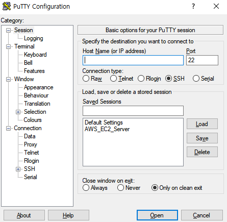
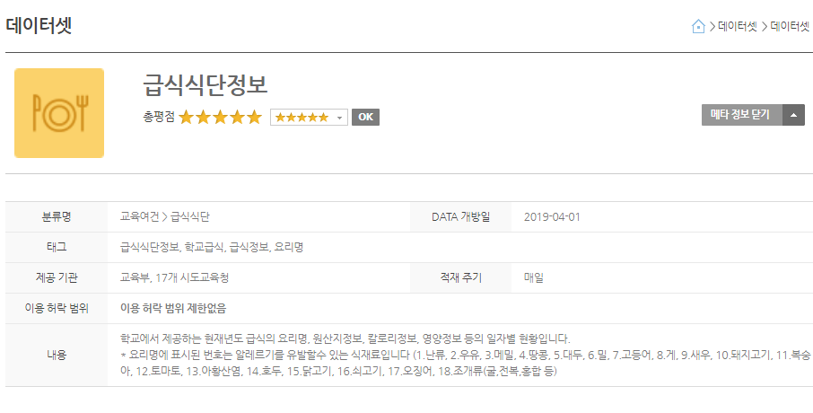
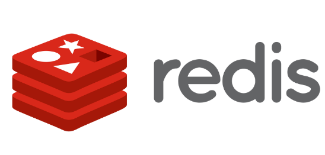
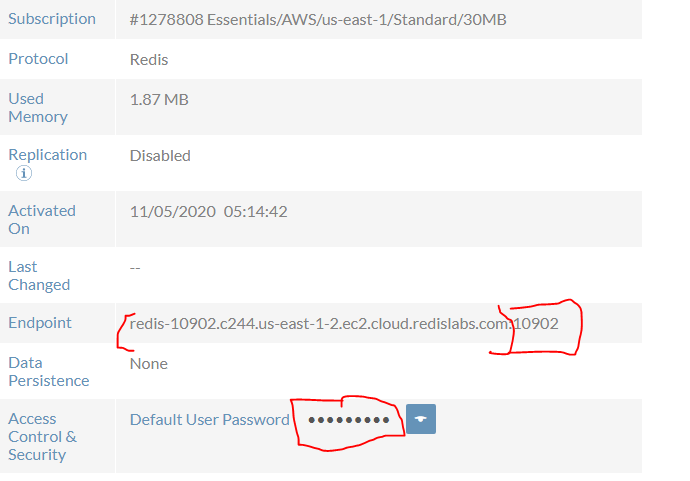
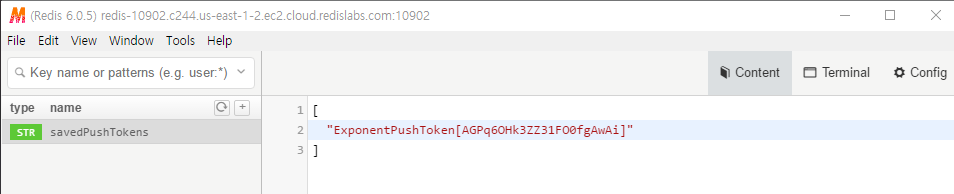

# AWS EC2

## EC2 로 ubuntu 서버 만들기

<a href="http://ec2-13-125-245-120.ap-northeast-2.compute.amazonaws.com:3000">오늘의 삼일상업고 급식</a>

# PUTTY



#### PUTTY 를 이용하여 ubuntu 서버에 접속하여 EC2 인스턴스를 컨트롤 할 수 있다. MAC 사용자는 그냥 터미널로 가능.

#### // 루트 사용자로 사용자 변경. :  sudo su -

#### // DNS 설정 :   echo 'nameserver 8.8.8.8' >> /etc/resolv.conf

위 명령어들을 입력해주면 대부분의 오류는 발생하지 않는다 (access 문제 등)

# 나이스 교육정보 개발포털



해당 API 를 통해 급식정보를 가져왔음



Redis 로 조회 및 삽입이 빠른 Redis를 설치한다

```javascript
yarn add ioredis
```

```javascript
const Redis = require('ioredis');
const redis = new Redis({
  host: '호스트',
  port: '포트',
  password: '비밀번호',
  db: 0
});
```
호스트 및 포트는 
https://app.redislabs.com/
에서 확인이 가능하다 

```javascript
// 데이터 저장.
redis.set('키', '값');

// 데이터 호출
const findData = await redis.get('키');
```

출처 : https://www.notion.so/0e88c368b1e346afba55b7757011457b



redis.set을 savedPushTokens 로 하게되면 해당 정보처럼 저장이 된다

```javascript
// 토근 배열 및 객체 경우 JSON.stringify 를 이용해 저장하며
redis.set('이름',JSON.stringify(데이터))
// JSON.Parse 를 통해 가져온다
JSON.parse(await redis.get('이름'))
```

